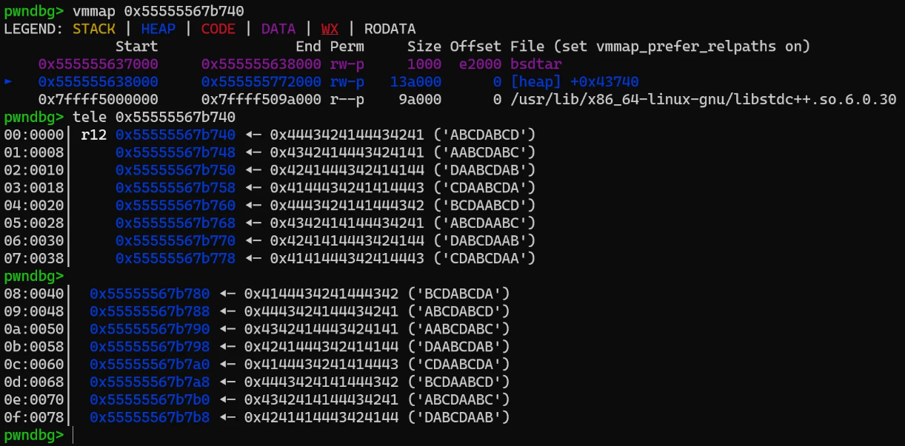
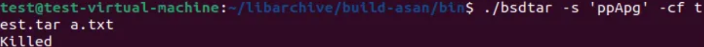

# Infinite Loop causes Out-of-Memory in `apply_substitution()` at `/libarchive/tar/subst.c`

## Summary

`bsdtar -s` pathname-rewrite rules can trigger an infinite substitution loop that repeatedly appends to the output buffer without advancing the input pointer. This causes unbounded memory growth and eventual OOM (Denial of Service). The loop is reachable whenever the search pattern can match the empty string under `/g` (global) replacement—e.g., an **empty pattern** or anchors like `^`.

---

## Details

Affected component: `bsdtar` `-s` option (pathname substitution), `apply_substitution()` in `/libarchive/tar/subst.c`.

- Path: `/libarchive/tar/subst.c`
- Functions:
    - `add_substitution(...)`: parses `s D/pattern/D/replace/D/flags` (D means delimeter) and compiles a POSIX Basic RE. It **permits empty patterns** (e.g., `pp...` when `p` is the delimiter).
    - `apply_substitution(...)`: runs the compiled regex and performs replacements:
        - On each match, it appends the unmatched prefix and the replacement to `result`.
        - It then does `name += matches[0].rm_eo;`
        - If `rule->global` is set, it loops again (`while (1)`) to find the next match on the **remaining string**.

**Bug condition:**

For patterns that can match the empty string (length 0), POSIX `regexec()` returns a match with `rm_eo == rm_so`. In that case, the code does not advance `name` (adds zero), so the next `regexec()` searches the same position, returns the same zero-length match, and the loop repeats indefinitely as long as `rule->global` is true. Because each iteration appends replacement bytes, the output allocation grows until the process is killed by OOM.

**Why it’s easy to hit:**

- **Empty pattern**: the parser accepts `D D` back-to-back delimiters (e.g., `ppApg` → pattern `""`, replace `"A"`, flags `"g"`).
- **Zero-length regexes** (even with non-empty patterns): `^`, `$`, `a*`, `.*`, etc., can all match an empty substring and trigger the same loop under `/g`.

---

## PoC

### Empty pattern + global

Create any non-empty directory `dir` (or file `a.txt`) with at least one file (content irrelevant), then run:

```bash
bsdtar -s 'ppApg' -cf /dev/null dir

# 0-length match + g 
bsdtar -s '/^/A/g' -cf /dev/null dir
bsdtar -s '/a*/A/g' -cf /dev/null dir
```

Explanation:

- Delimiter: `p` (can possible `/` and so on)
- Pattern: empty (`""`) — because the second `p` immediately closes it
- Replacement: `A`
- Flags: `g` (global)
    
    Result: `apply_substitution()` loops forever appending `A` without advancing `name`, memory usage climbs until OOM.
    

---

### Static Analysis

apply_substitution() code:

```c
while (1) {
    // If no match for this rule, stop processing.
    if (regexec(&rule->re, name, 10, matches, 0))
        break;

    got_match = 1;
    print_match |= rule->print; // keep existing print flag (do not clear)

    // 1) Append the portion of the original before the match to 'result'
    while (1) {
        if (regexec(&rule->re, name, 10, matches, 0))
            break;

        got_match = 1;
        print_match |= rule->print;

        // 1-1) realloc and append the prefix (text before the match)
        realloc_strncat(result, name, matches[0].rm_so);

        // 2) Interpret the replacement string 'rule->result' and append
        for (i = 0, j = 0; rule->result[i] != '\0'; ++i) {
            if (rule->result[i] == '~') {
                realloc_strncat(result, rule->result + j, i - j);
                realloc_strncat(result, name + matches[0].rm_so, matches[0].rm_eo - matches[0].rm_so);
                j = i + 1;
                continue;
            }
            if (rule->result[i] != '\\')
                continue;
        }

        // 3) After the loop, append any remaining literal tail of 'rule->result'
        realloc_strcat(result, rule->result + j);

        // 4) Advance 'name' to the end of the current match
        name += matches[0].rm_eo;

        // 5) If 'global' is set, keep looping; otherwise, stop
        if (!rule->global)  // rule->global == 1 → continue the while-loop
            break;
    }
}

```

[1] First iteration

1 ) `regexec(&rule->re, name, 10, matches, 0)`

- The pattern is empty, so it **always matches** (returns 0).
- `matches[0].rm_so == 0`, `matches[0].rm_eo == 0`
    
    (a **zero-length match** at the current `name` position; nothing is consumed)
    

1-1 ) `realloc_strncat(result, name, matches[0].rm_so)`

- Since `matches[0].rm_so == 0`, **copy 0 bytes**.

2 ) Exit the replacement-loop body

- There’s no `~` (or other special markers), so nothing special to process.

3 ) `realloc_strcat(result, rule->result + j)`

- After the loop, append from `+j` into `result`.
- Here `j = 0`, so one `'A'` is appended to `result`.

4 ) `name += matches[0].rm_eo;`

- Advance `name` by `rm_eo` → but it’s 0, so **no change**.

5 ) `if (!rule->global) break;`

- `rule->global == 1`, so **no break**; go back to the start of `while (1)`.

---

[2] Second iteration

- Proceeds the same way:
    - `regexec` again returns 0.
    - `matches[0]` is still `(0, 0)`.
    - `realloc_strncat(..., len = 0)` copies **0 bytes** again.
- `realloc_strcat(result, rule->result + j)`
    - `j` is still 0, so another `'A'` is appended.
- `name += 0` → no forward progress.
- `global == 1` → loop continues.

→ As a result, `realloc_strcat` keeps appending `'A'` indefinitely while `name` never advances, causing an **infinite loop** and unbounded growth of `result`.

### Dynamic Analysis

`gdb -q --args ./bsdtar -s '//ABCDABCDA/g' -cf test.tar a.txt` 



- Infinite heap increased through realloc → Increase heap chunk infinite



- Finally process killed

---

## Impact

- **Denial of Service:** Unbounded memory growth culminating in OOM kill; CPU consumed in tight loop.
- **Reliability & availability risk:** A single crafted `s` rule can crash CLI workflows, CI/CD jobs, build systems, or server-side packaging services that invoke `bsdtar`.
- **Blast radius:** If `bsdtar` runs in privileged automation or shared infrastructure, repeated invocations can degrade or terminate other co-located services via memory pressure.

**Conditions to exploit:** Attacker (or untrusted input) can influence the `-s` rule used by `bsdtar` (e.g., user-facing tooling that forwards substitution rules, automated pipelines reading rules from configuration, or APIs that wrap `bsdtar`).

Likely CWEs: **CWE-835 (Loop with Unreachable Exit Condition)**, **CWE-400 (Uncontrolled Resource Consumption)**.

### **CVSS v3 base metrics**

Attack vector : **Local**

Attack complexity : **Low**

Privileges required : **None**

User interaction : **Required**

Scope : **Unchanged**

Confidentiality : **None**

Integrity : **None**

Availability : **High**
